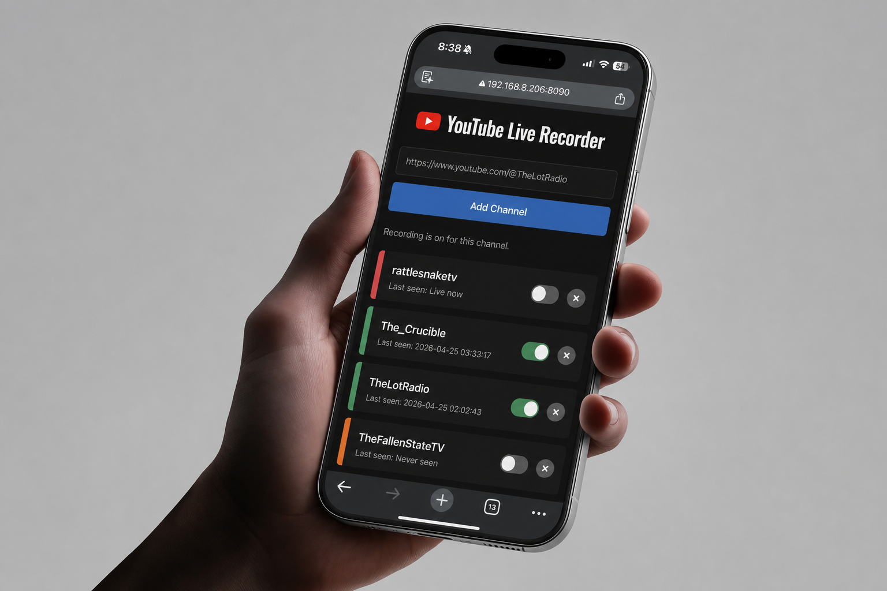

# YouTube Live Auto Recorder for Ugreen NAS

A simple Docker app for Ugreen NAS users who want to automatically record YouTube livestreams.

Open the web dashboard, add YouTube channel links, and the recorder will keep checking those channels. When a channel goes live, the stream is saved into that channel's recordings folder.

This project is built primarily for the Ugreen NAS Docker app. It may also work on other Docker systems, but the easiest setup path below is written for Ugreen NAS owners.



## Features

- Monitor multiple YouTube channels from one simple web dashboard.
- Automatically start recording when a monitored channel goes live.
- Keep recordings organized in one folder per channel.
- Turn recording on or off for each channel without removing it from the list.
- Continue monitoring channels even when recording is turned off.
- Save finished livestreams as MP4 files using a NAS-friendly fast remux workflow.

## Easiest Ugreen NAS Install

Use this method if you are installing from the Ugreen NAS desktop Docker app.

1. Open your Ugreen NAS desktop.
2. Open the Docker app.
3. Click Image.
4. Search for:

```text
csselement/yt-auto-recorder
```

5. Pull the image from Docker Hub.
6. Create a container from the image.
7. Set the port mapping:

```text
8090 -> 8090
```

8. Add two folder mappings:

```text
/config      stores the channel list and settings
/recordings  stores finished livestream recordings
```

For the NAS side of those mappings, choose real folders on your Ugreen NAS. For example:

```text
/volume1/docker/yt-auto-recorder/config
/volume1/recordings/youtube
```

If the Ugreen Docker app says a NAS path was not found, create that folder first in the Ugreen File Manager, then try again.

9. Start the container.
10. Open the dashboard in a browser:

```text
http://NAS_IP_ADDRESS:8090
```

For example:

```text
http://192.168.8.206:8090
```

Use `http`, not `https`, unless you have set up your own reverse proxy.

## How To Use It

Add YouTube channel links in this format:

```text
https://www.youtube.com/@TheLotRadio
```

The dashboard only accepts channel links like the example above. Do not use normal video links, shortened `youtu.be` links, or `/live` links.

Each channel has a Rec on/off switch.

- Rec on: the channel is monitored and future livestreams will be recorded.
- Rec off: the channel stays in the list and is still monitored, but new recordings will not start.
- If a channel is already recording, turning Rec off does not stop the current recording. It only prevents future recordings.

Recordings are saved under the `/recordings` folder you mapped in Docker. The recorder keeps one folder per channel.

## What To Expect

The app checks channels on a timer. By default, it checks about every 30 seconds.

If you add a channel while it is already live, the recorder tries to start from the beginning of the livestream using YouTube's live rewind/DVR data. If YouTube does not provide the beginning of the stream, recording starts from the current live position.

Finished recordings are saved as `.mp4` files. While a stream is still recording, temporary `.mkv` files may appear. After the stream ends, the app finalizes them into MP4.

## Recording Format

The default setup is meant to be light on Ugreen NAS CPU.

By default, the app uses fast remuxing:

```text
FINALIZE_MODE=remux
```

Remuxing copies the video and audio into an MP4 container without re-encoding. This is much faster than transcoding.

The recorder also asks YouTube for MP4-friendly streams when possible:

```text
YTDLP_FORMAT=bestvideo[vcodec^=avc1]+bestaudio[acodec^=mp4a]/best[vcodec^=avc1][acodec^=mp4a]/best
```

That means it prefers H.264 video and AAC/M4A audio, which can usually become MP4 without heavy CPU work.

## Ugreen Compose Option

If you prefer using a Docker Compose project in the Ugreen Docker app, use `docker-compose.ugreen.yml`.

The published image is:

```text
csselement/yt-auto-recorder:latest
```

In UGOS Pro:

1. Open Docker from the Ugreen NAS desktop.
2. Go to Project > Create.
3. Paste or upload the contents of `docker-compose.ugreen.yml`.
4. Click Deploy.
5. Open:

```text
http://NAS_IP_ADDRESS:8090
```

The Ugreen compose file uses project-relative folders:

```yaml
volumes:
  - ./config:/config
  - ./recordings:/recordings
```

This avoids Ugreen's "NAS path not found" validation error.

## General Docker Information

Docker packages the dashboard, recorder, `yt-dlp`, `ffmpeg`, and required dependencies into one container.

Inside the container:

- `/config` stores the channel list and dashboard settings.
- `/recordings` stores livestream recordings.
- The dashboard listens on port `8090`.

With the included local `docker-compose.yml`, files are stored here:

```text
./data/config/recording-channels.txt
./data/recordings/
```

## Run Locally

From this folder:

```bash
docker compose up -d --build
```

Open:

```text
http://localhost:8090
```

If Docker Desktop is not running, start Docker Desktop first and wait until it says Docker is running.

## Useful Commands

Start or update after edits:

```bash
docker compose up -d --build
```

Stop:

```bash
docker compose down
```

View logs:

```bash
docker compose logs -f
```

Rebuild with the latest `yt-dlp`:

```bash
docker compose build --no-cache
docker compose up -d
```

## Settings

These environment variables are available in `docker-compose.yml`:

- `CHECK_INTERVAL`: seconds between channel checks. Default is `30`.
- `CHANNEL_LIST`: path inside the container for the monitored channel list.
- `SETTINGS_FILE`: path inside the container for per-channel settings.
- `BASE_DIR`: path inside the container for recordings.
- `FINALIZE_MODE`: how finished `.mkv` files become `.mp4`. Default is `remux`. Set to `transcode` only if you need H.264 video with MP3 audio.
- `YTDLP_FORMAT`: yt-dlp format selector. Default prefers H.264 video and AAC/M4A audio.
- `VIDEO_CRF`: H.264 quality for `FINALIZE_MODE=transcode`. Lower is higher quality/larger files. Default is `23`.
- `VIDEO_PRESET`: H.264 encoding speed for `FINALIZE_MODE=transcode`. Default is `veryfast`.
- `AUDIO_BITRATE`: MP3 audio bitrate for `FINALIZE_MODE=transcode`. Default is `192k`.

## Build Your Own Image

If you fork this project or want to publish your own Docker image, replace every `USERNAME` placeholder with your Docker Hub login name.

For example, if your Docker Hub login is `janedoe`, then:

```text
USERNAME/yt-auto-recorder:latest
```

becomes:

```text
janedoe/yt-auto-recorder:latest
```

Then build and push a multi-architecture image:

```bash
docker login
docker buildx create --use --name yt-auto-recorder-builder
docker buildx build --platform linux/amd64,linux/arm64 -t USERNAME/yt-auto-recorder:latest --push .
```

## Notes

- If one channel is recording, other channels continue being checked.
- If more than one `.mkv` file is present for a channel, the recorder concatenates them sequentially before creating the final MP4.
- Transcoding is available, but it is much heavier on NAS CPU than the default remux mode.
